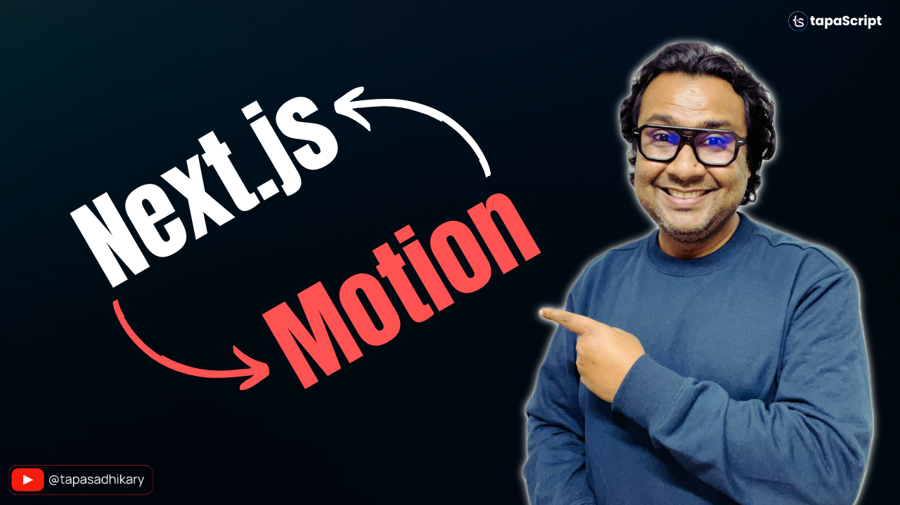

# Next.js with Framer Motion/Motion Animation

Let's Integrate Next.js With Framer Motion/Motion Animation.

## 🫶 Support
Liked it? It takes months of hard work to create quality content and present to you. You can show your support to me with a STAR(⭐) to this repository.

> Many Thanks to all the `Stargazers` who have supported this project with stars(⭐)

### 🤝 Sponsor My Work
I am an independent educator and open-source enthusiast who creates meaningful projects to teach programming on my YouTube Channel. **You can support my work by [Sponsoring me on GitHub](https://github.com/sponsors/atapas) or [Buy Me a Cofee](https://buymeacoffee.com/tapasadhikary)**.

## The Video Tutorial
In this video tutorial, we have developed a UI design with the "Thinking in React" mindset.

Here is the video for you to go through and learn:

## How to Run
- Install dependencies using `npm install`
- Run it using `npm run dev`
- The app will be available on `localhost:3000`

